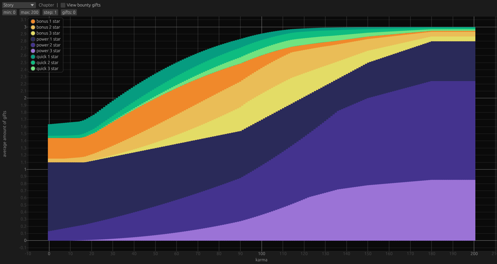
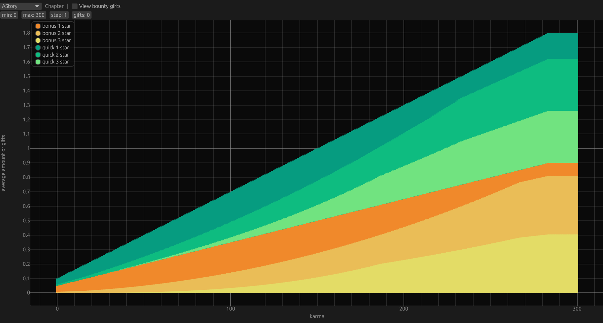
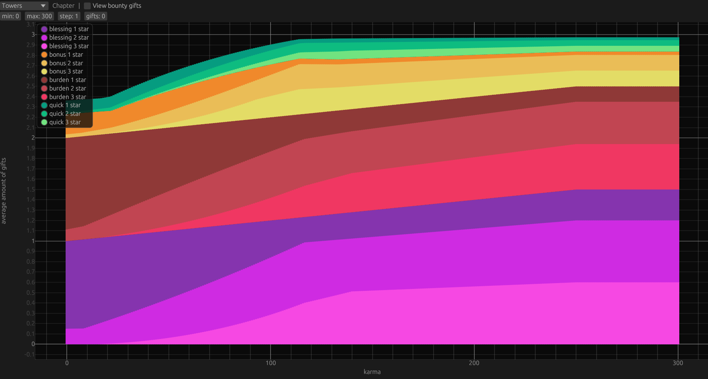
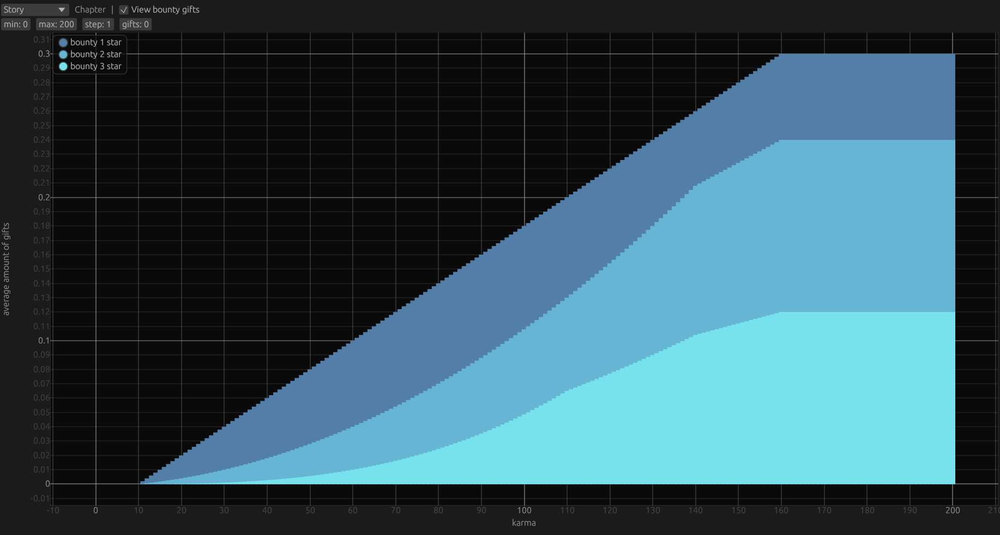

# About
This is a data visualisation project for the videogame "the void rains upon her heart".
Specifically I aim to visualize how the distribution of gifts you receive per monster in this game is influenced by your 'karma' stat

# Example
This is the result for the gift distribution in normal story chapters. The height of each colored bar is the average rate at which this type of gift will show up. You can see that the total height approaches 3 which is the amount of gift slots a monster has.

In Alter Story you get between 3 and 6 extra boss fights, these have a different gift distribution without power gifts

In the new Tower mode you get both blessings and burdens on every gift, the burden you get is dependent on the rank of the blessing you receive. In towers you have normal chapters and special chapters (who have a different distribution).

In all categories you also have bounty gifts, these are independent of all other gifts. This is an example of the bounty gift distribution in story mode

# How to run
This project was made using rust. You can use it yourself by cloning this repository and then compiling this repo using the [rust compiler](https://doc.rust-lang.org/book/ch01-01-installation.html).
